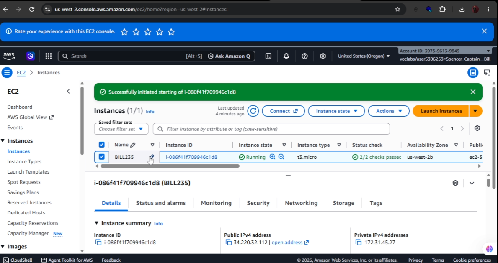
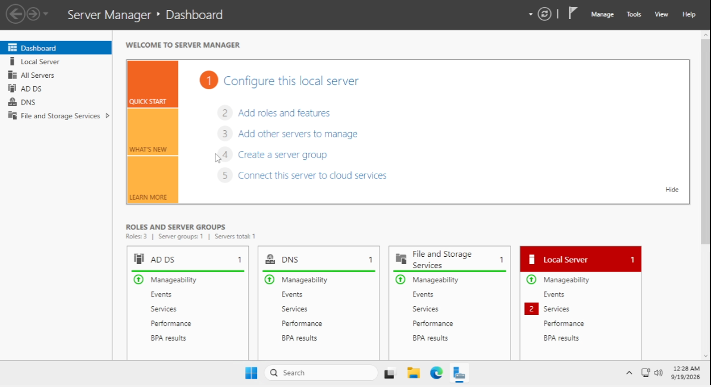
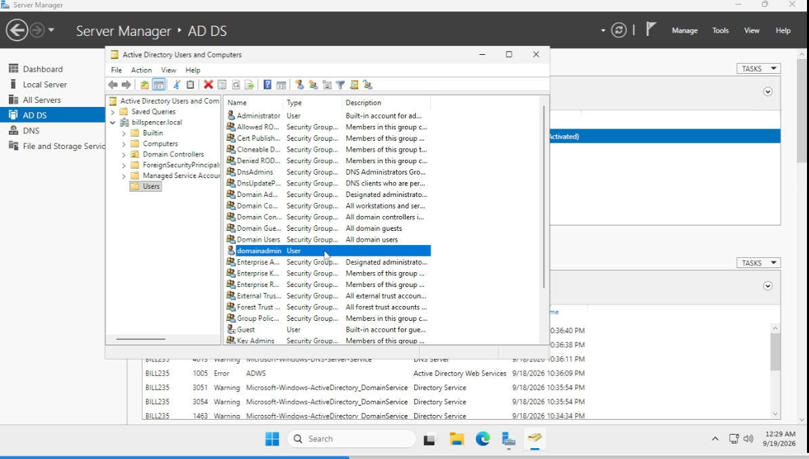
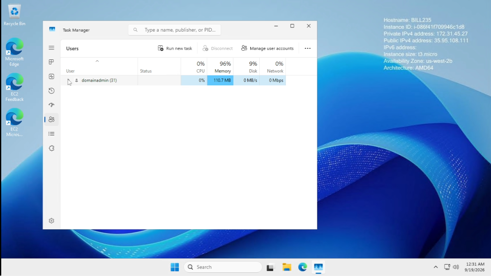
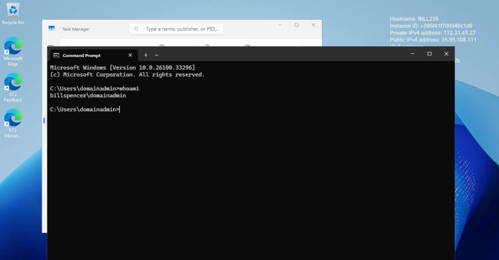

# 🛡️ Lab 01: AWS EC2 Provisioning & Active Directory Domain Controller Promotion

## 📌 Overview
This lab demonstrates end-to-end cloud infrastructure setup and identity management. An AWS EC2 instance was provisioned, configured, and renamed (`BILL235`), followed by the installation and promotion of **Active Directory Domain Services (AD DS)** for the root domain `billspencer.local`. Finally, domain administrator access was configured and verified.

---

## 🎥 Video Demonstration & Proof
* 📹 **Watch the Full Walkthrough Video:** https://vimeo.com/1226095906?fl=tl&fe=ec  || https://vimeo.com/1228242495?fl=tl&fe=ec

## ⚙️ Environment Details
* **Cloud Provider:** AWS Academy (EC2)
* **Operating System:** Windows Server 2025
* **Server Hostname:** `BILL235`
* **Root Domain Name:** `billspencer.local`
* **Domain Admin Account:** `billspencer.local\domainadmin`

---

## 🛠️ Step-by-Step Implementation

### Phase 1: AWS EC2 VM Setup & Host Configuration
1. Provisioned a Windows Server 2022 EC2 instance on AWS Academy.
2. Retrieved the instance credentials and connected securely via Remote Desktop Protocol (RDP).
3. Configured system properties and renamed the host to **`BILL235`**.

### Phase 2: Active Directory Domain Services (AD DS) Promotion
1. Launched **Server Manager** and added the **Active Directory Domain Services** role.
2. Initiated promotion to a Domain Controller within a new forest: `billspencer.local`.
3. Set a strong Directory Services Restore Mode (DSRM) password.

### Phase 3: Custom Domain Administrator Provisioning
1. Prior to completing promotion reboot, created a local user named `domainadmin` via **Computer Management** (`compmgmt.msc`).
2. Added `domainadmin` to the local **Administrators** group to ensure automatic migration to the **Domain Admins** group upon reboot.
3. Configured account flags: *Password Never Expires* enabled; *User Must Change Password at Next Logon* disabled.

### Phase 4: Explicit Domain Authentication & Verification
1. Re-established RDP connection explicitly using domain credentials: `billspencer.local\domainadmin`.
2. Verified identity via **GUI**: Checked the **Task Manager** $\rightarrow$ **Users** tab showing `billspencer.local\domainadmin`.
3. Verified identity via **CLI**: Executed `whoami` in Command Prompt returning `billspencer.local\domainadmin`.

---

## 📸 Screenshots & Verification Evidence

| Step | Description | Evidence |
| :--- | :--- | :--- |
| **01** | **AWS EC2 Host Configuration** |  |
| **02** | **AD DS Role Installation** |  |
| **03** | **Domain Admin Group Membership** |  |
| **04** | **GUI Verification (Task Manager)** |  |
| **05** | **CLI Verification (`whoami`)** |  |

---

## 💡 Key Takeaways
* **Centralized Identity Control:** Demonstrates how AD DS establishes a single authority for user authentication and authorization across enterprise networks.
* **Security Best Practices:** Using `domainname\domainadmin` rather than default `Administrator` accounts helps audit administrative sessions clearly.
