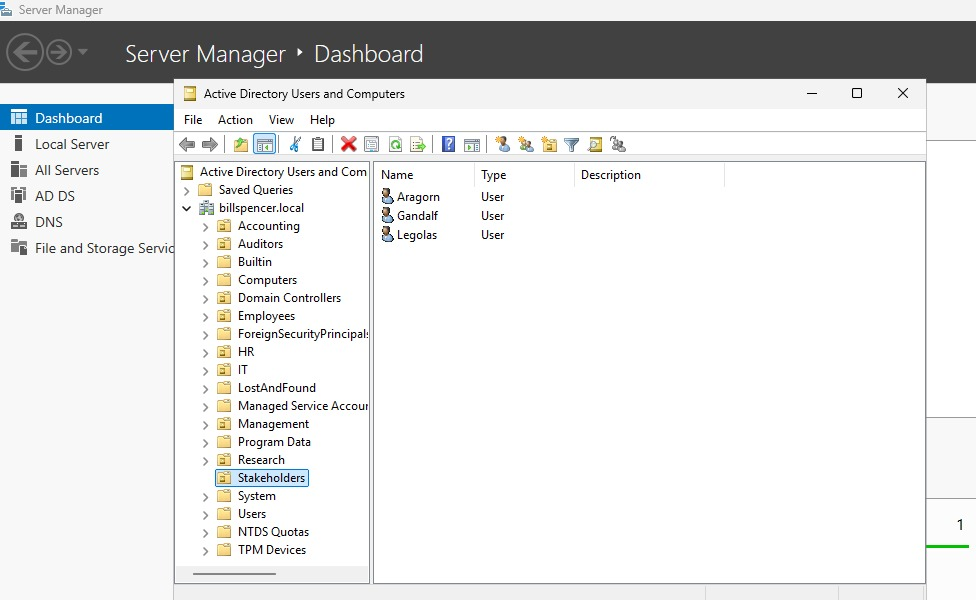
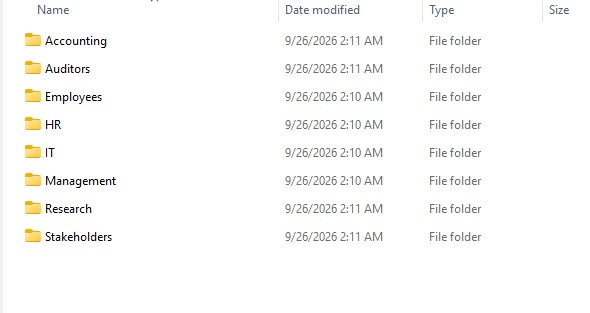
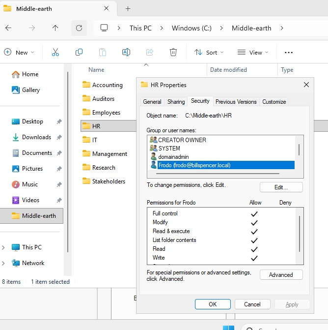
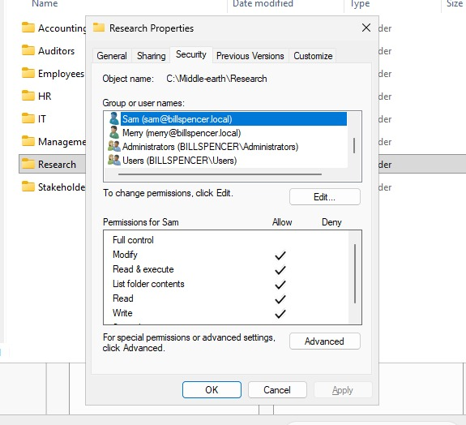
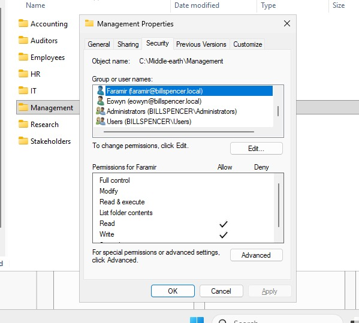

# Lab 02: Active Directory Organizational Units (OUs) & NTFS Directory Security Permissions

## 📌 Project Overview

This lab demonstrates the administrative implementation of a structured domain environment using **Active Directory Domain Services (AD DS)** and **NTFS File System Security Permissions** on Windows Server 2022.

The objective was to design and deploy an enterprise-aligned Organizational Unit (OU) structure, populate user accounts across departmental units, build a corresponding file system hierarchy inside `C:\Middle-earth`, and enforce strict NTFS security permissions adhering to the **Principle of Least Privilege (PoLP)**.

## 🛠️ Environment & Architecture Details

* **Domain Name:** `billspencer.local`
* **Server OS:** Windows Server 2022 Datacenter
* **Root Directory Path:** `C:\Middle-earth`
* **Account Standard Settings:** All user accounts configured with `Password never expires`.

---

## 🏗️ Active Directory & Folder Hierarchy Matrix

| Department / OU | User Accounts Created | Directory Path | Applied NTFS Permissions | 
| ----- | ----- | ----- | ----- | 
| **Employees** | *(Default organizational container)* | `C:\Middle-earth\Employees` | Default Inherited | 
| **HR** | Frodo | `C:\Middle-earth\HR` | **Full Control** | 
| **IT** | Gimli | `C:\Middle-earth\IT` | **Full Control** | 
| **Stakeholders** | Gandalf, Aragorn, Legolas | `C:\Middle-earth\Stakeholders` | **Modify** | 
| **Research** | Sam, Merry | `C:\Middle-earth\Research` | **Modify** | 
| **Management** | Boromir, Faramir, Eowyn | `C:\Middle-earth\Management` | **Read & Write** | 
| **Auditors** | Arwen, Bilbo | `C:\Middle-earth\Auditors` | **Full Control** | 
| **Accounting** | Gollum, Pippin | `C:\Middle-earth\Accounting` | **Modify** | 

---

## 📸 Implementation Screenshots & Verification

### 1. Active Directory OU & User Account Structure
> *Verification of Organizational Units and user placements in Active Directory Users and Computers (`dsa.msc`).*

---

### 2. File Explorer Folder Hierarchy
> *Verification of the local folder hierarchy created at `C:\Middle-earth` matching the AD OUs.*

---

### 3. Granular NTFS Permission Verification

#### A. HR Folder (Frodo - Full Control)
> *Demonstrating Full Control assigned explicitly to Frodo.*

#### B. Research Folder (Sam & Merry - Modify)
> *Demonstrating Modify permission assigned to Sam and Merry.*

#### C. Management Folder (Faramir, Boromir, Eowyn - Read & Write)
> *Demonstrating explicit Read & Write permissions assigned to Management personnel.*

---

## ⚙️ Key Implementation Steps

### 1. Active Directory OU & User Provisioning
1. Launched **Active Directory Users and Computers** (`dsa.msc`) on `billspencer.local`.
2. Provisioned 8 top-level Organizational Units matching organizational departments.
3. Created individual user accounts within their respective departmental OUs.
4. Ensured account parameters were properly set with passwords configured to never expire.

### 2. Directory Hierarchy Construction
1. Navigated to local storage `C:\` on the Windows Server host.
2. Created the primary root directory `Middle-earth`.
3. Established subdirectories corresponding to every Active Directory departmental OU.

### 3. Granular NTFS Permission Configuration
1. Configured Security Properties for each departmental directory under `C:\Middle-earth\`.
2. Explicitly added designated Active Directory user accounts to the Access Control List (ACL).
3. Assigned precise NTFS permission bits (**Full Control**, **Modify**, or **Read & Write**) based on privilege requirements.
4. Verified inheritance and security settings to prevent unauthorized access across departments.

---

## 📽️ Video Demonstration

A complete walk-through demonstrating Active Directory OU navigation, user account placement, and NTFS Security tab verification is available in the demonstration video linked below:

---

## 👤 Author

* **Bill Spencer Captain**
* *IT & Cybersecurity Student | Systems Administration & Cloud Infrastructure*
* GitHub: [@Spence-X](https://github.com/Spence-X?utm_source=gemini)
