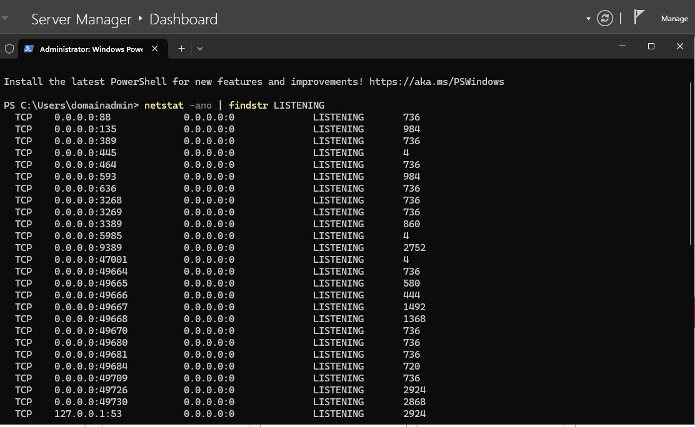
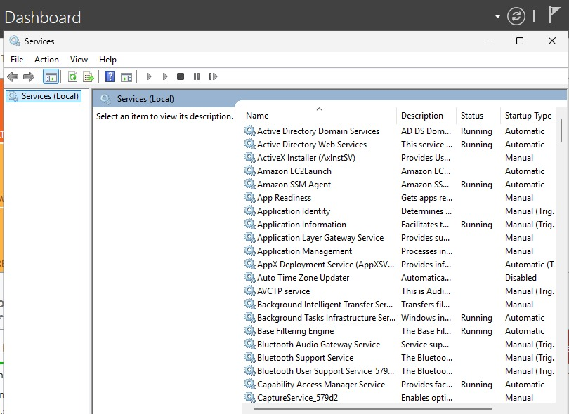
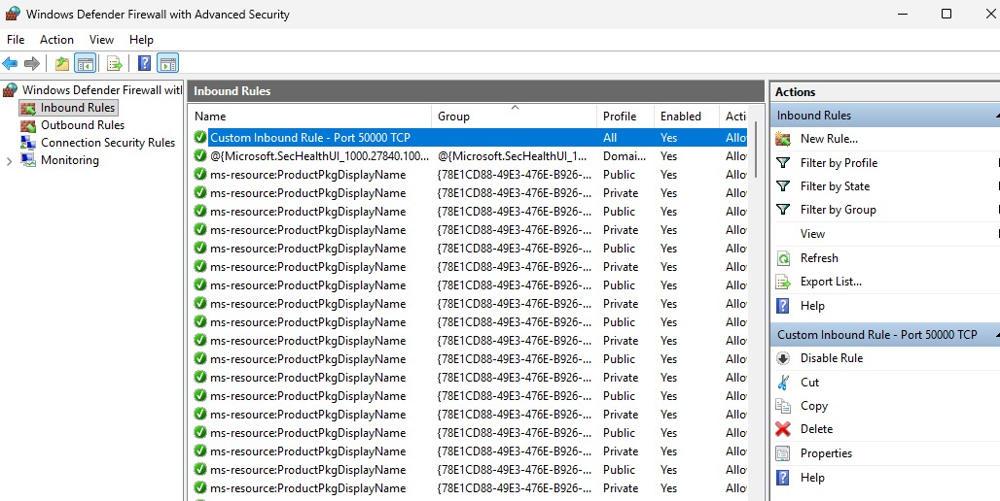
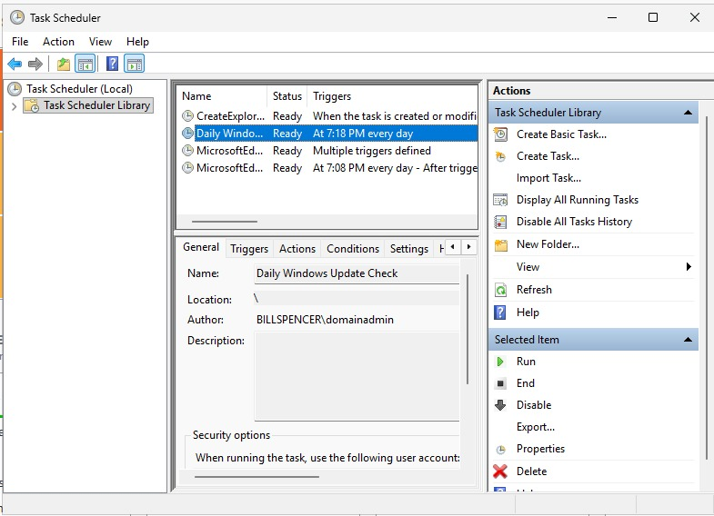

# Lab 03: Windows Server Network Ports, Services, Firewall & Task Automation


---

## 📌 Executive Summary

This hands-on administrative lab focuses on core system network exposure, active service management, custom host-based firewall security policies, and task automation on **Windows Server 2025**.

To maintain enterprise operational security and infrastructure reliability, system administrators must accurately inspect active listening ports, map network dependencies to running services, enforce granular firewall filtering based on traffic classification, and automate routine operational maintenance.

### Key Objectives Achieved:
1. **Network Port Analysis:** Executed command-line port state inspection to discover active socket listeners and mapped PIDs to core infrastructure services (**Port 53 DNS** and **Port 389 LDAP**).
2. **Service Mapping:** Evaluated domain-critical network services (**DNS Server** and **Active Directory Domain Services**) running on the primary Domain Controller.
3. **Custom Firewall Enforcements:** Configured explicit inbound and outbound filtering rules on **Windows Defender Firewall with Advanced Security** for **TCP Port 50000**, verifying live rule state toggling.
4. **Maintenance Automation:** Provisioned an automated daily task in **Task Scheduler** to trigger systematic update compliance scans.

---

## 🎯 Architecture & Technical Breakdown

```
+-----------------------------------------------------------------------------------+
|                            WINDOWS SERVER 2025 (DC)                               |
|                         Domain: billspencer.local                                 |
+-----------------------------------------------------------------------------------+
       |                                      |                                 |
       v                                      v                                 v
[Active Ports & PIDs]               [Core Network Services]            [Firewall & Automation]
 • Port 53 (DNS / UDP&TCP)           • DNS Server (DNS)                 • Custom TCP 50000 In/Out
 • Port 389 (LDAP / TCP)             • Active Directory DS (NTDS)       • Daily Update Task Trigger
+-----------------------------------------------------------------------------------+
```

---

## 🛠️ Step-by-Step Implementation & Verification

### Task 1: Network Port Identification (`netstat`)

Active listening sockets were identified using the Windows Command Prompt and PowerShell CLI tools.

```cmd
netstat -ano | findstr LISTENING
```

#### Identified Key Network Ports:
* **Port 53 (DNS - Domain Name System):** Listens for incoming hostname-to-IP resolution queries from domain clients. Essential for Active Directory locator services.
* **Port 389 (LDAP - Lightweight Directory Access Protocol):** Listens for authentication requests, directory object queries, and schema lookups across `billspencer.local`.

screenshot showing `netstat -ano | findstr LISTENING` terminal output highlighting Port 53 and Port 389 alongside their Process IDs (PIDs).*


---

### Task 2: Active Network Services Management

Network-dependent system services were inspected via the Services MMC Snap-in (`services.msc`).

#### Evaluated Services:
1. **DNS Server (`DNS`):**
   * **Service Name:** `DNS`
   * **Description:** Provides domain name resolution for AD DS clients and translates FQDNs into routable IPv4 addresses within the internal network segment.
2. **Active Directory Domain Services (`NTDS`):**
   * **Service Name:** `NTDS`
   * **Description:** Stores directory database objects (users, groups, computers) and manages security principals, domain authentication, and Group Policy enforcement.

screenshot of `services.msc` showing the DNS Server and Active Directory Domain Services running status.


---

### Task 3: Custom Windows Defender Firewall Rules (TCP Port 50000)

To control network perimeter access on the host, custom rule sets were provisioned using **Windows Defender Firewall with Advanced Security** (`wf.msc`).

#### Configuration Specifications:
* **Rule Type:** Port
* **Protocol:** TCP
* **Specific Local Port:** `50000`
* **Action:** Allow the connection
* **Profiles:** Domain, Private, Public

```powershell
# Alternative PowerShell Verification / Provisioning
New-NetFirewallRule -DisplayName "Custom Inbound Rule - Port 50000 TCP" -Direction Inbound -LocalPort 50000 -Protocol TCP -Action Allow
New-NetFirewallRule -DisplayName "Custom Outbound Rule - Port 50000 TCP" -Direction Outbound -LocalPort 50000 -Protocol TCP -Action Allow
```

#### Operational State Demonstration:
The firewall rules were visually demonstrated and validated in both **Enabled** and **Disabled** states to ensure operational readiness for application-specific port requirements.

screenshot showing both Inbound and Outbound rules for Port 50000 in the Windows Defender Firewall console.


---

### Task 4: Automated Task Scheduling for System Updates

To maintain patch management compliance without manual intervention, a daily scheduled task was configured in **Task Scheduler** (`taskschd.msc`).

#### Task Attributes:
* **Task Name:** `Daily Windows Update Check`
* **Trigger:** Daily at scheduled baseline maintenance windows
* **Action:** Start a Program
* **Program/Script:** `powershell.exe`
* **Arguments:** `-Command "UsoClient StartScan"`

screenshot of Task Scheduler Library displaying the active "Daily Windows Update Check" basic task.


---

## 📹 Video Walkthrough & Script Reference

A full 2-minute video walkthrough demonstrating all live configuration checks, firewall state toggling, and service inspections is available in the repository assets.

* **Script & Voiceover Guide:** [View Video Demo Guide](https://youtu.be/dflP8BSbo08)

---

## 🎓 Academic & Professional Context

* **Institution:** Ensign College
* **Program:** Information Technology / Cybersecurity
* **Course:** Systems Administration & Network Security
* **Author:** Bill Spencer Captain
* **Portfolio Repository:** [cybersecurity-and-sysadmin-labs](https://github.com/Spence-X/cybersecurity-and-sysadmin-labs)

---

## 🔐 Verification & Security Summary

| Component | Standard Port / Protocol | Target Service / Tool | Security Governance Role |
| :--- | :--- | :--- | :--- |
| **DNS Resolution** | Port 53 (TCP/UDP) | `DNS Server` | Enables FQDN routing & AD domain controller discovery |
| **Directory Lookup** | Port 389 (TCP/UDP) | `NTDS` (AD DS) | Enforces centralized kerberos / directory authorization |
| **Host Defense** | Port 50000 (TCP) | `Windows Defender Firewall` | Controls inbound/outbound custom socket communication |
| **Patch Automation** | N/A | `Task Scheduler` | Ensures continuous system update vulnerability remediation |
