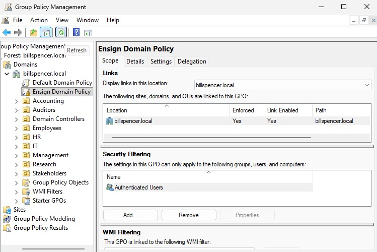
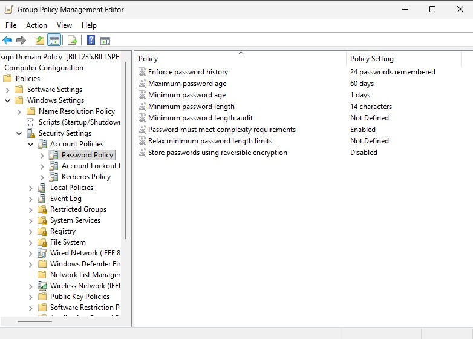
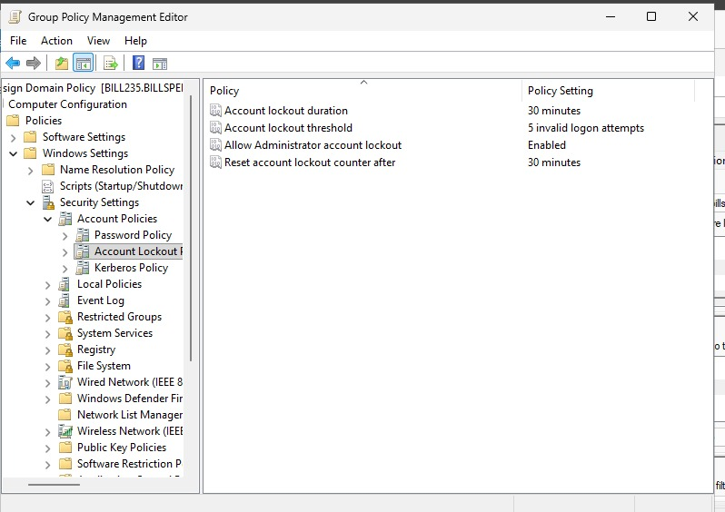
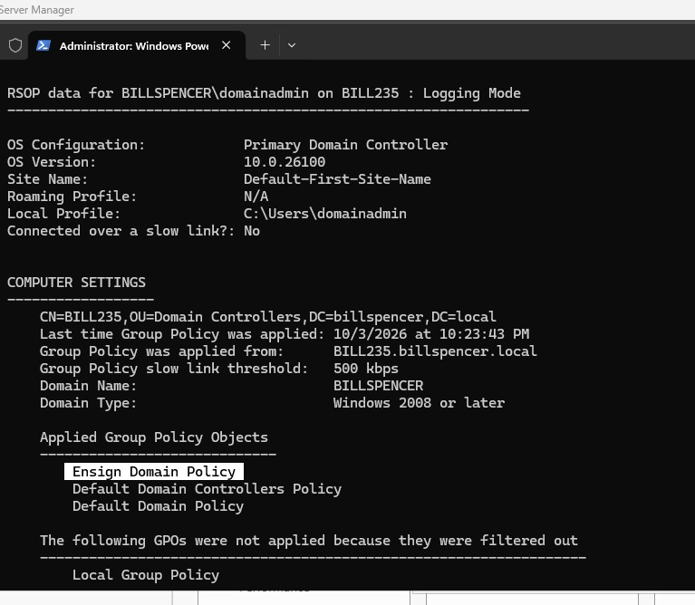
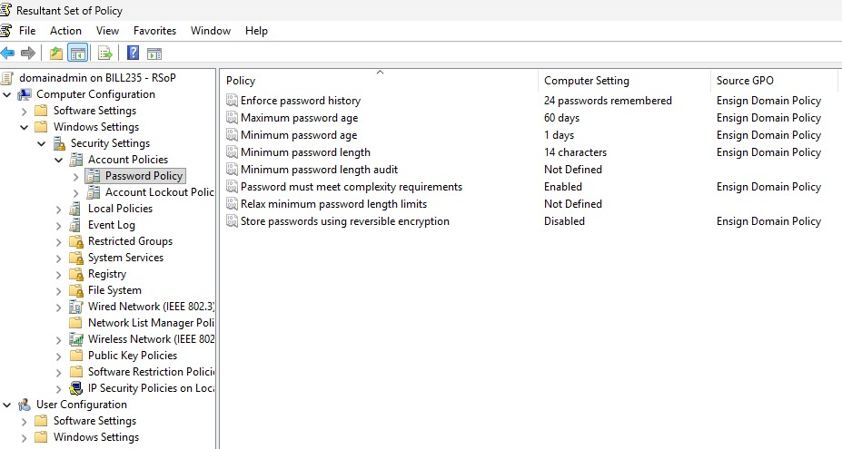

# Lab 04: Active Directory Group Policy Objects (GPO) & Security Hardening


---

## 📌 Executive Summary
This laboratory project demonstrates the creation, linking, enforcement, and verification of domain-wide **Group Policy Objects (GPOs)** on **Windows Server 2022** (`billspencer.local`). 

By implementing an enforced custom Group Policy named **Ensign Domain Policy**, account baseline security was hardened to protect against brute-force attacks, credential spraying, and unauthorized password reuse across the enterprise directory environment.

---

## 🎯 Objectives & Assignment Scope
* **GPO Creation & Precedence Enforcement:** Provision `Ensign Domain Policy` linked directly to the root domain (`billspencer.local`) with **Enforced** priority to override default domain policy rules.
* **Password Policy Hardening:** Enforce strict password complexity, history, and age parameters.
* **Account Lockout Policy Configuration:** Mitigate automated authentication attacks by enforcing lockout thresholds, durations, and administrator account protection.
* **Propagation & Compliance Verification:** Validate live policy application across the host system using Command Line tools (`gpupdate /force`, `gpresult /r`) and the Resultant Set of Policy (`rsop.msc`) MMC snap-in.

---

## ⚙️ Technical Configurations & Policy Matrix

### 1. Password Policy Requirements
Path: `Computer Configuration` > `Policies` > `Windows Settings` > `Security Settings` > `Account Policies` > `Password Policy`

| Policy Setting | Target Standard | Security Rationale |
| :--- | :--- | :--- |
| **Enforce password history** | `24 passwords remembered` | Prevents immediate cycling and reuse of legacy credentials. |
| **Maximum password age** | `60 days` | Forces periodic rotation to minimize exposure window of leaked hashes. |
| **Minimum password age** | `1 day` | Prevents users from rapidly bypassing the history limit in a single day. |
| **Minimum password length** | `14 characters` | Increases entropy, drastically extending offline cracking time. |
| **Password must meet complexity requirements** | `Enabled` | Mandates uppercase, lowercase, numbers, and special symbols. |
| **Store passwords using reversible encryption** | `Disabled` | Prevents storing credentials in plain-text equivalent format in Active Directory. |

---

### 2. Account Lockout Policy Requirements
Path: `Computer Configuration` > `Policies` > `Windows Settings` > `Security Settings` > `Account Policies` > `Account Lockout Policy`

| Policy Setting | Target Standard | Security Rationale |
| :--- | :--- | :--- |
| **Account lockout duration** | `30 minutes` | Temporarily halts unauthorized automated login attempts. |
| **Account lockout threshold** | `5 invalid logon attempts` | Blocks brute-force and dictionary attack patterns early. |
| **Reset account lockout counter after** | `30 minutes` | Standardizes the observation window before resetting failure counts. |
| **Allow Administrator account lockout** | `Enabled` | Prevents targeted lockout bypass on the Built-in Domain Administrator account. |

---

## 🛠️ Verification & Implementation Steps

### Command Line Verification
Policy propagation was forced and verified via Administrator PowerShell:

```powershell
# Force immediate Group Policy refresh
gpupdate /force

# Generate Summary Resultant Set of Policy (RSOP)
gpresult /r
```
### Verification Result: Under COMPUTER SETTINGS > Applied Group Policy Objects, the output confirms that Ensign Domain Policy was successfully fetched and applied.

## 🖼️ Visual Evidence & Proof of Implementation
1. GPO Creation & Enforcement Link
Ensign Domain Policy linked to domain root with Enforced padlock badge.


2. Password Policy Configuration
GPO Management Editor showing all 6 Password Policy rules configured.


3. Account Lockout Policy Configuration
GPO Management Editor showing Account Lockout thresholds and Administrator protection enabled.


4. CLI Policy Enforcement Verification
Terminal showing gpupdate /force completion and gpresult /r displaying Applied GPOs.


5. Resultant Set of Policy (RSOP) Audit
rsop.msc snap-in displaying Ensign Domain Policy as the active Source GPO for Account Policies.



👤 Author & Lab Metadata
 Author: Bill Spencer Captain

 Environment: Windows Server 2025 Datacenter (billspencer.local)

 Institution: Ensign College / BYU-Pathway Worldwide
 
 Course: Cloud Server Active Directory Domain Services & Enterprise Administration
